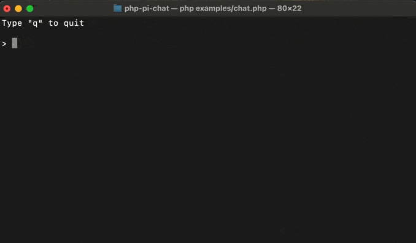

# Pi chatbot client

[](https://opensource.org/licenses/MIT)
[](https://packagist.org/packages/maximerenou/pi-chat)
[](https://packagist.org/packages/maximerenou/pi-chat)
[](https://packagist.org/packages/maximerenou/pi-chat)

This is an unofficial PHP client for **Pi** chatbot (from **Inflection AI**). It doesn't require authentication.

## Installation

    composer require maximerenou/pi-chat

## Demo

Run `examples/chat.php` to test it.



## Usage

```php
use MaximeRenou\PiChat\Client as PiChat;
use MaximeRenou\PiChat\Prompt;

$chatbot = new PiChat();

$conversation = $chatbot->createConversation();

// $answer - full answer
$answer = $conversation->ask(new Prompt("Hello World"));
```

<details>
  <summary>Real-time / progressive answer</summary>

> Pi tends to send the whole message in one shot so this can be useless.

You may pass a function as second argument to get real-time progression:

```php
// $current_answer - incomplete answer
// $tokens - last tokens received
$final_answer = $conversation->ask($prompt, function ($current_answer, $tokens) {
    echo $tokens;
});
```

</details> 

<details>
  <summary>Resume a conversation</summary>  

If you want to resume a previous conversation, you can retrieve its identifiers:

```php
// Get current identifiers
$identifiers = $conversation->getIdentifiers();

// ...
// Resume conversation with $identifiers parameter
$conversation = $chatbot->resumeConversation($identifiers);
```

</details> 

<details>
  <summary>Error handling</summary>

The code throws exceptions when it receives an error from Pi. You can therefore use a try/catch block to handle errors.

</details>

---------------------------------------

#### Disclaimer

This code is for educational purpose only. Using Pi outside heypi.com may violate Inflection AI terms.
